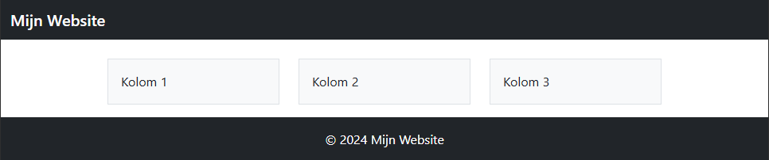
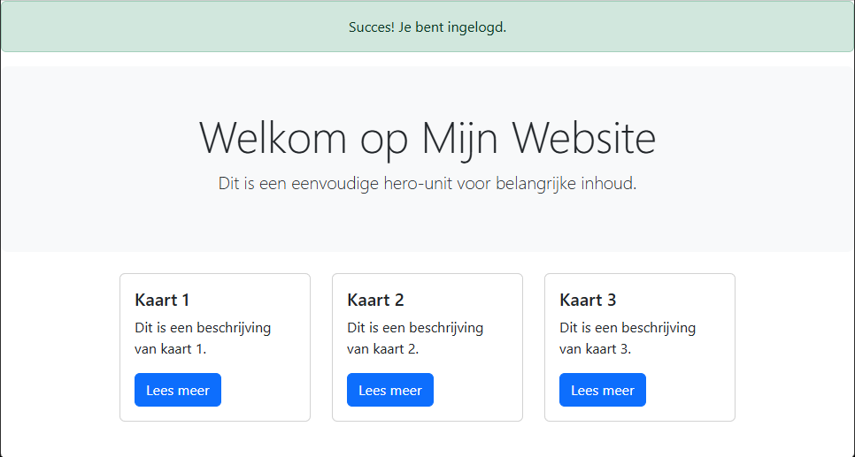
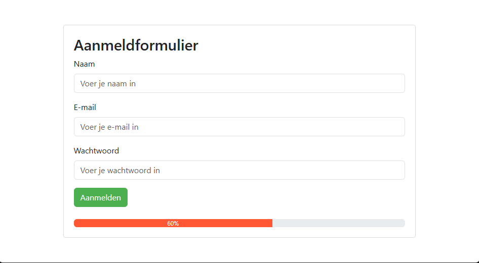

# Oefeningen: Werken met Bootstrap

## Oefening 1: Maak een Responsieve Layout

Maak een eenvoudige webpagina met Bootstrap's grid-systeem. De pagina moet het volgende bevatten:

1. **Header** (volle breedte): Gebruik een `<nav>` met een achtergrondkleur.
2. **Drie kolommen** onder de header:
   - **Desktop**: 3 kolommen naast elkaar (elk 4 kolommen breed).
   - **Tablet**: 2 kolommen naast elkaar, en de derde kolom eronder.
   - **Mobiel**: Alle 3 de kolommen onder elkaar.
3. **Footer** (volle breedte): Een eenvoudige tekst met gecentreerde uitlijning.

## Oefening 2: Gebruik van Bootstrap-componenten

Bouw een pagina met de volgende elementen:

1. Een jumbotron of hero-sectie met een titel en korte beschrijving.
2. Een kaart-layout met drie kaarten naast elkaar. Elke kaart bevat:
   - Een afbeelding.
   - Een titel en een korte tekst.
   - Een knop die naar een andere pagina zou kunnen leiden.
3. Een alert bovenaan de pagina met een succesmelding.

## Oefening 3: Aanpassen van Bootstrap met eigen CSS

Maak een eenvoudige pagina met Bootstrap en pas deze aan met je eigen CSS.

1. Gebruik het standaard Bootstrap-formulier voor een aanmeldingspagina met:
   - Velden voor naam, e-mail en wachtwoord.
   - Een verzendknop.
2. Voeg een progress-bar toe onder het formulier die een willekeurig percentage weergeeft.
3. Gebruik je eigen CSS om:
   - De knoppen een aangepaste kleur te geven.
   - De achtergrondkleur van de progress-bar te veranderen.
   - De marges en padding van het formulier te wijzigen.

